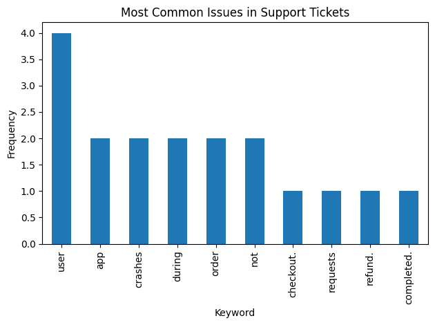
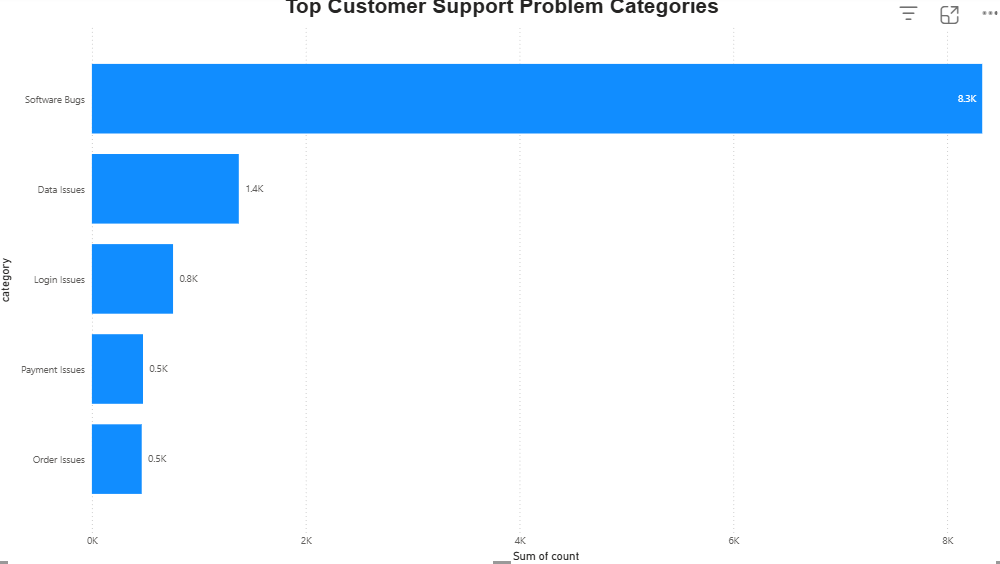

# Dark Data Discovery & Insight Engine

I built an end-to-end system that discovers, cleans, and analyzes forgotten/unstructured company data to uncover hidden customer problems and convert them into actionable business insights.

Using a real-world customer support ticket dataset, this project simulates how organizations can extract value from data that is typically collected but never meaningfully analyzed.

---

## 🚀 Business Problem

Companies store massive volumes of unstructured data such as support tickets, logs, and emails.  
Most of this data is never explored, despite containing critical signals about product failures, customer pain points, and operational inefficiencies.

This project demonstrates how dark data can be transformed into clear, decision-ready insights.

---

## 🛠 What I Built

- Ingested and processed **8,000+ customer support tickets**
- Cleaned and standardized unstructured text using Python  
- Removed noise (stopwords, symbols, placeholders)  
- Performed keyword frequency analysis  
- Categorized issues into business-level problem groups  
- Exported processed insights to Excel  
- Built Power BI dashboard to visualize and communicate results  

---

## ⚙️ Challenges & How I Solved Them

**Messy and noisy text data**  
Customer ticket descriptions contained filler words, placeholders, and inconsistent formatting.  
→ Implemented custom stopword filtering and text cleaning pipelines in Python.

**Meaningless keyword output in early iterations**  
Initial frequency analysis surfaced generic words instead of real issues.  
→ Added domain-based keyword grouping and issue categorization logic.

**Integrating Python outputs with Power BI**  
Ensured processed results were exported to structured Excel files that Power BI could directly consume.

These steps improved signal quality and produced business-relevant insights.

---

## 📊 Key Results

Top customer problem categories discovered:

- Software Bugs  
- Data Issues  
- Login Issues  
- Payment Issues  
- Order Issues  

Software-related defects were the dominant driver of support volume, indicating a strong opportunity for engineering prioritization.

---

## 📈 Sample Output

### Python Prototype (Small Sample)

### Power BI Dashboard (Real Dataset)

---

## 💡 Business Impact

- Enables teams to prioritize engineering fixes based on real customer pain  
- Reduces time spent manually reviewing tickets  
- Creates a scalable framework for analyzing any unstructured text source  
- Supports data-driven product and support decisions  

---

## 🔧 Tech Stack

Python, Pandas, Excel, Power BI

