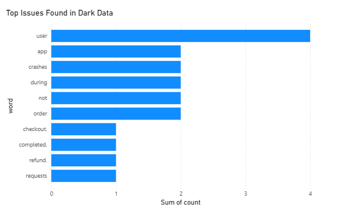

# Dark Data Discovery Project

An end-to-end beginner data analytics project that discovers hidden insights from forgotten company data.

## Tech Stack
Python, Pandas, Excel, Power BI

## What This Project Does
- Scans unstructured files (emails, logs, tickets)
- Extracts hidden issues from support tickets
- Performs keyword frequency analysis
- Exports insights to Excel
- Visualizes findings with charts and dashboards
## Sample Output

### Python Analysis

### Power BI Dashboard

## Key Insight
Login failures, application crashes, and checkout issues are the most frequent hidden customer problems.

